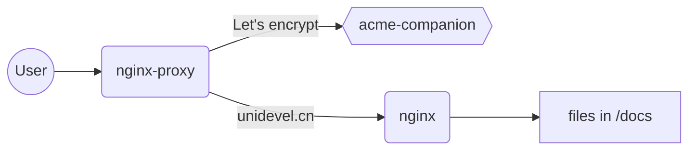
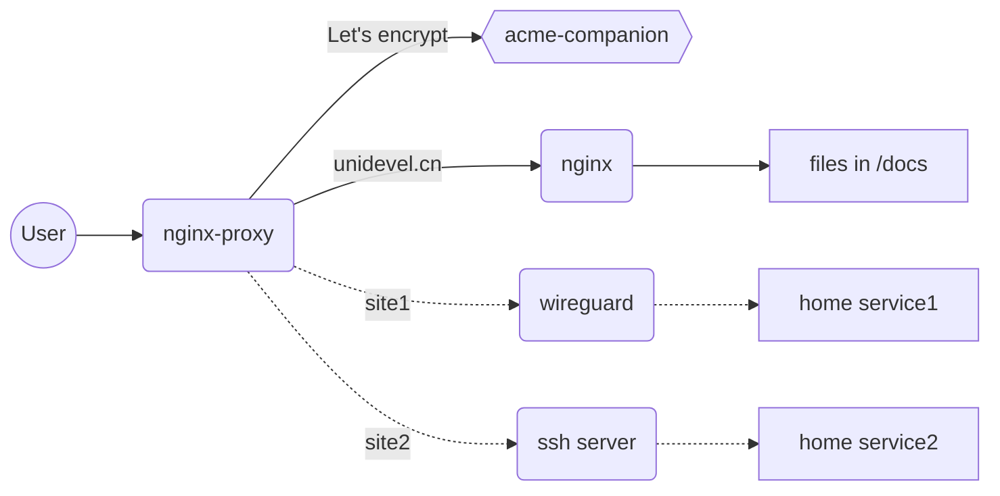

# 网站架构

本网站使用[docisify](https://docsify.js.org/)制作，使用[nginx-proxy](https://github.com/nginx-proxy/nginx-proxy)作为网页服务器, [acme-companion](https://github.com/nginx-proxy/acme-companion)生成安全证书，使用[docker](https://www.docker.com/)进行容器化部署。由于没有数据库服务，网站服务占用资源很少，512M的服务器跑起来应该都没问题。

部署十分方便，在 [docker-compose.yml](https://github.com/unidevel/mysite/blob/main/docker-compose.yaml) 所在目录使用 `docker compose up -d` 即可完成部署。

# 内网扩展

对于个人网站，云服务不需要太高的配置，但如果想跑一些比较耗资源的服务，可以考虑使用自己的主机或笔记本，通过[ssh远程端口转发](https://www.ssh.com/academy/ssh/tunneling-example#remote-forwarding)或者[wireguard虚拟专用网络](https://github.com/linuxserver/docker-wireguard)，结合[nginx-proxy](https://github.com/nginx-proxy/nginx-proxy)的自动代理功能，发布这些服务，这样云主机省下的费用可以买一台二手笔记本或者主机，维护升级也方便。整体架构如下：

ssh和wireguar的对比，总体来说各有优劣

| | ssh | wireguard |
|-|-|-|
|稳定性|容易掉线，不易自动恢复| 稳定，可以自动重连 |
|配置| 配置简单，不需要特殊的配置既可完成端口转发 | 配置较复杂，需要配置iptables的规则实现端口转发|
|适用场景| 开发、短时间的使用 | 稳定、长期的服务 |
