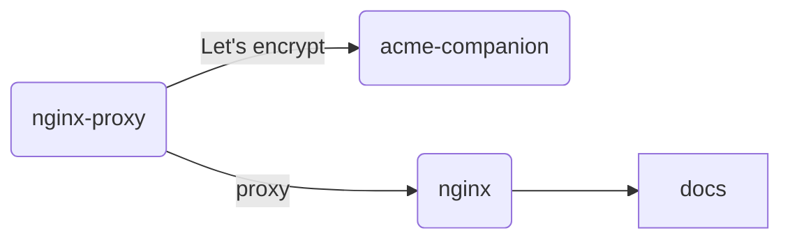

# 网站架构

本网站使用[docisify](https://docsify.js.org/)制作，使用[nginx-proxy](https://github.com/nginx-proxy/nginx-proxy)作为网页服务器, [acme-companion](https://github.com/nginx-proxy/acme-companion)生成安全证书，使用[docker](https://www.docker.com/)进行容器化部署。

部署十分方便，在 [docker-compose.yml](https://github.com/unidevel/mysite/blob/main/docker-compose.yaml) 所在目录使用 `docker compose up -d` 即可完成部署。
